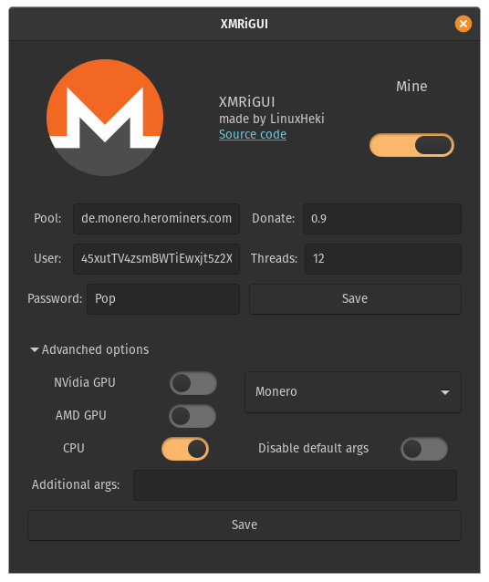

# XMRiGUI

XMRiGUI is free and open-source crypto miner for Linux. It uses [XMRig](http://github.com/xmrig/xmrig) for mining and GTK3 for GUI.

 
 

## Features
Coins:
* Monero
* Ravencoin
* Uplexa
* Chukwa
* Chukwa v2
* CCX
* Keva
* Dero
* Talleo
* Safex
* ArQmA
* NINJA

Other cryptos **may** work if the algorithm is the same.

Mining backends:
* **CPU**
* **OpenCL** for AMD GPUs
* **CUDA** for NVIDIA GPUs
 
 

If you want this to work on arm processor like on Raspberry Pi, you need to build [XMRig](https://github.com/xmrig/xmrig) yourself, do [Custom XMRig](https://github.com/LinuxHeki/XMRiGUI#custom-xmrig) and than [build this](https://github.com/LinuxHeki/XMRiGUI#build-from-source).

If OpenCL doesn't work try to install [this driver](https://github.com/Diolinux/amd-opencl-pro-linux-resolve).

For CUDA to work you need to build [Cuda plugin](http://github.com/xmrig/xmrig-cuda#linux-usage) and put it into `/opt/xmrigui/`

**I NEVER TESTED OPENCL OR CUDA BECAUSE I DON'T HAVE THAT GOOD GPU! PLEASE TEST AND IF SOMETHING GOES WRONG PLEASE REPORT!**
 
 

## Build from source
If you want to build XMRiGUI from source, you'll need to have:
* python3
* gtk3
* pyinstaller
 
 

`make && sudo make install`

or If you want deb package:

`make && make deb`
 
 

## Custom XMRig
If you want to use custom version of XMRig you need to replace `xmrig` with the new one and than reinstall XMRiGUI or replace `/opt/xmrigui/xmrig` and restart the app.
 
 

## Donate

If you want to support me, please mine for some hours with my wallet and don't forget to set custom password ; ). Thank you!
 
Monero address: `45xutTV4zsmBWTiEwxjt5z2XpPyKMf4iRc2WmWiRcf4DVHgSsCyCyUMWTvBSZjCTwP9678xG6Re9dUKhBScPmqKN6DUXaHF`
 
Pool (optional): `de.monero.herominers.com:1111`