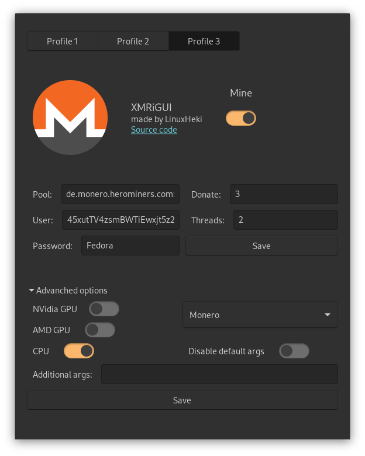

# XMRiGUI

XMRiGUI is free and open-source crypto miner for Linux. It uses [XMRig](http://github.com/xmrig/xmrig) for mining and GTK3 for GUI.

 
 

## Features
Coins:
* **Monero**
* Ravencoin (soon)
* Chukwa (soon)
* CCX (soon)
* Keva (soon)
* Dero (soon)
* Talleo (soon)
* Safex (soon)
* ArQmA (soon)
* NINJA (soon)
* Wownero (soon)

Other cryptos **may** work if the algorithm is the same.

Mining backends:
* **CPU** x64
* **CPU** ARMv8 (soon)
* **OpenCL** for AMD GPUs (soon)
* **CUDA** for NVIDIA GPUs (soon)
 
 

## Build from source
If you want to build XMRiGUI from source, you'll need to have:
* python3
* pyinstaller
* gtk3
 
 

`make && sudo make install`

or If you want deb package:

`make && make deb`
 
 

## Donate

If you want to support me, please mine for some hours with my wallet and don't forget to set custom password ; ). Thank you!
 
Monero address: `45xutTV4zsmBWTiEwxjt5z2XpPyKMf4iRc2WmWiRcf4DVHgSsCyCyUMWTvBSZjCTwP9678xG6Re9dUKhBScPmqKN6DUXaHF`
 
Pool (optional): `de.monero.herominers.com:1111`